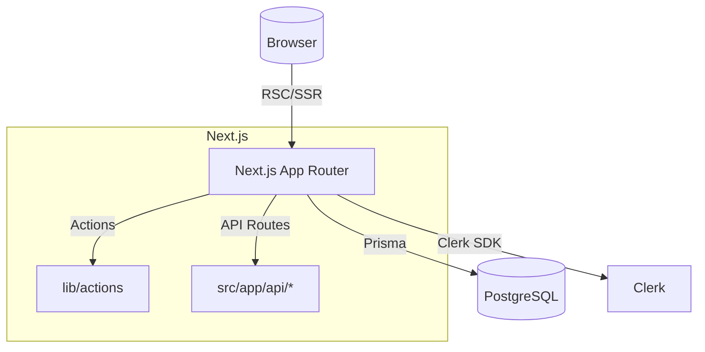

# Architecture

## High-Level Diagram

## Key Decisions
- Next.js App Router with React Server Components for fast, complete page loads.
- Authentication with Clerk; user mapped via `clerkUserId` in Prisma.
- Server Actions in `src/lib/actions/` called from RSC components and API handlers for single source of truth.
- API routes in `src/app/api/*` mirror actions for external integrations.
- Prisma with PostgreSQL; use indexes and lean queries.
- Caching:
  - Static segments for public share pages where possible.
  - `fetch` caching and `revalidate` where appropriate.
  - Action results not cached; queries wrapped with short TTL if safe.

## Data Flow
- Server renders pages with data fetched in RSC using Prisma via `db` client.
- Mutations go through server actions that enforce authz and validation.
- API handlers import the same actions for parity.

## Error Handling
- Zod validates payloads.
- Typed errors and consistent JSON error shape `{ error: { code, message, details? } }`.
- UI shows toast or inline error from action result.

## Security
- Auth required for all creator routes.
- Ownership/role checks in every action and API.
- Share links have revocation and optional password.

## Deployment
- Vercel recommended. Enable Edge for read-heavy public pages if feasible.
- Use a pooled Postgres (Neon + pgbouncer, Supabase, or RDS + pgbouncer).
